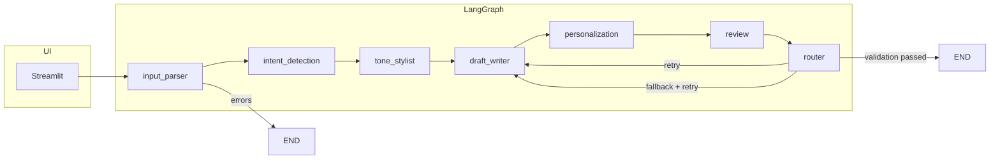
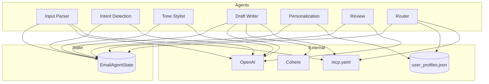

# AI-Powered Email Assistant — System Architecture

This document describes the system architecture of the AI-Powered Email Assistant: layers, components, workflow, and data flow.

---

## 1. Overview

The system is a **multi-agent pipeline** that turns a user’s natural-language request (plus tone, intent, and recipient) into a **personalized, reviewed email draft**. Orchestration is done with **LangGraph**; the UI is **Streamlit**; user data and draft history are stored in a **JSON memory layer**; and **MCP-style config** (`mcp.yaml`) drives model choice and fallback routing.

```
┌─────────────────────────────────────────────────────────────────────────────────┐
│                           STREAMLIT UI LAYER                                      │
│  Context + tone/intent selectors | Prompt input | Preview/editor | Export TXT/PDF │
└───────────────────────────────────────────┬─────────────────────────────────────┘
                                            │
                                            ▼
┌─────────────────────────────────────────────────────────────────────────────────┐
│                        LANGGRAPH ORCHESTRATION                                    │
│  Entry → input_parser → [conditional] → intent_detection → tone_stylist          │
│         → draft_writer → personalization → review → router → [conditional]        │
│         → END | RETRY draft_writer (with optional fallback model)                  │
└───────────────────────────────────────────┬─────────────────────────────────────┘
                                            │
        ┌───────────────────────────────────┼───────────────────────────────────┐
        ▼                   ▼                ▼                ▼                   ▼
┌───────────────┐  ┌──────────────┐  ┌──────────────┐  ┌──────────────┐  ┌──────────────┐
│ Input Parser  │  │ Intent       │  │ Tone Stylist │  │ Draft Writer │  │ Personalize  │
│ (validate,    │  │ Detection    │  │ (formal/     │  │ (LLM body +  │  │ (profile +   │
│ extract)      │  │ (classify)   │  │ casual/     │  │ subject)     │  │ history)     │
└───────────────┘  └──────────────┘  │ assertive)  │  └──────────────┘  └──────────────┘
                                     └──────────────┘
        │                   │                │                │                   │
        └───────────────────┴────────────────┴────────────────┴───────────────────┘
                                            │
                    ┌───────────────────────┼───────────────────────┐
                    ▼                       ▼                       ▼
            ┌──────────────┐        ┌──────────────┐        ┌──────────────┐
            │ Review       │        │ Router       │        │ Memory       │
            │ (tone/       │        │ (retry/      │        │ (user_       │
            │ grammar/     │        │ fallback)    │        │ profiles.json)│
            │ coherence)   │        │              │        │ draft_history │
            └──────────────┘        └──────────────┘        └──────────────┘
                                            │
                    ┌───────────────────────┴───────────────────────┐
                    ▼                                               ▼
            ┌──────────────┐                                ┌──────────────┐
            │ MCP Config   │                                │ LLM Clients  │
            │ mcp.yaml     │                                │ OpenAI /     │
            │ (models,     │                                │ Cohere       │
            │ routing)     │                                │ (fallback)   │
            └──────────────┘                                └──────────────┘
```

---

## 2. Architecture Layers

| Layer | Technology | Responsibility |
|-------|-------------|----------------|
| **Presentation** | Streamlit | User input (prompt, tone, intent, recipient), live preview, editable body, export TXT/PDF, profile editor. |
| **Orchestration** | LangGraph | StateGraph with nodes per agent; conditional edges (input_parser → end/intent_detection; router → end/draft_writer); single shared state. |
| **Agents** | Python modules | Input Parser, Intent Detection, Tone Stylist, Draft Writer, Personalization, Review, Router — each reads/updates `EmailAgentState`. |
| **Memory** | JSON file | User profiles and draft history at `src/memory/user_profiles.json`; path from `config.PROJECT_ROOT` + `mcp.yaml` `persist_path`. |
| **Control plane** | mcp.yaml | Model definitions (primary/fallback), routing (max_retries, fallback flags), per-agent settings, memory limits. |
| **LLM** | OpenAI, Cohere | Primary: OpenAI (e.g. gpt-4o). Fallback: Cohere (e.g. command-r) when Router triggers after failed validation and retries. |

---

## 3. Workflow (Mermaid)



**Conditional logic:**

- **After input_parser:** If `errors` non-empty → **END**. Else → **intent_detection**.
- **After router:** If `validation_passed` → **END**. Else if `retry_count < max_retries` → **draft_writer**. Else if not `fallback_triggered` → set fallback, then **draft_writer**. Else → **END**.

---

## 4. Component Diagram (Mermaid)



---

## 5. Data Flow

1. **Input:** User submits prompt, tone, optional intent, recipient name/company. Streamlit calls `run_email_pipeline(...)` with initial `EmailAgentState`.
2. **Input Parser:** Validates prompt; LLM extracts `parsed_input` (recipient, key_points, constraints, word_limit, urgency). On failure, appends `errors` and graph goes to END.
3. **Intent Detection:** Classifies into one of: outreach, follow_up, apology, information, request, negotiation, rejection, thank_you. Writes `detected_intent` and optional confidence/reasoning into state.
4. **Tone Stylist:** Builds `tone_instructions` from selected tone (formal/casual/assertive), intent, and user profile (e.g. preferred_phrases, sign_off); optionally uses `data/tone_samples/*.txt`.
5. **Draft Writer:** Uses `parsed_input`, `tone_instructions`, `user_profile` to generate `subject_line`, `raw_draft`, `draft_components`. Uses OpenAI by default; uses Cohere when `fallback_triggered` is true.
6. **Personalization:** Loads user profile from JSON; injects name, company, role, sign_off into `raw_draft` → `personalized_draft`; appends draft to user’s `draft_history` and persists JSON.
7. **Review:** Scores tone alignment, grammar, and coherence; enforces word_limit if set. If checks fail, LLM produces corrected text → `reviewed_draft`. Sets `validation_passed` and `review_report`.
8. **Router:** If `validation_passed` → set `final_email`, persist to history, go to END. Else: if retries left → increment `retry_count`, go to draft_writer; else if fallback not used → set `fallback_triggered`, go to draft_writer; else → persist and END. Each decision is logged to `routing_log`.
9. **Output:** State returned to Streamlit; UI shows `final_email`, `subject_line`, validation report, routing log; user can edit, copy, or export TXT/PDF.

---

## 6. Shared State Schema (EmailAgentState)

| Field | Type | Description |
|-------|------|-------------|
| user_prompt | str | Raw user request. |
| user_id | str | Identifies user for profile and history. |
| selected_tone | str | formal \| casual \| assertive. |
| selected_intent | str | Optional user override; empty = auto-detect. |
| recipient_name, recipient_company | str | From UI or parsed. |
| parsed_input | dict | recipient_name, recipient_company, key_points, constraints, word_limit, urgency_level (and intent metadata). |
| detected_intent | str | Classified intent. |
| tone_instructions | str | Instructions for Draft Writer. |
| raw_draft | str | Draft before personalization. |
| personalized_draft | str | After profile/sign_off injection. |
| reviewed_draft | str | After review/correction. |
| final_email | str | Output body (set by Router). |
| subject_line | str | Email subject. |
| draft_components | dict | greeting, body, call_to_action, closing, etc. |
| retry_count | int | Number of retries to draft_writer. |
| fallback_triggered | bool | Whether Cohere fallback is active. |
| model_used | str | Last LLM provider used. |
| validation_passed | bool | Review result. |
| errors | list | Accumulated error messages. |
| review_report | dict | tone_score, coherence_score, word_count, grammar_issues, etc. |
| user_profile | dict | Loaded from memory. |
| draft_history | list | Recent drafts (in memory). |
| routing_log | list | Router decisions and metadata. |

---

## 7. File Layout (Architecture View)

```
email_assistant/
├── src/
│   ├── state.py              # EmailAgentState
│   ├── agents/               # One module per agent
│   │   ├── input_parser_agent.py
│   │   ├── intent_detection_agent.py
│   │   ├── tone_stylist_agent.py
│   │   ├── draft_writer_agent.py
│   │   ├── personalization_agent.py
│   │   ├── review_agent.py
│   │   └── router_agent.py
│   ├── workflow/
│   │   └── langgraph_flow.py  # StateGraph, compile(), run_email_pipeline()
│   ├── ui/
│   │   └── streamlit_app.py
│   ├── memory/
│   │   └── user_profiles.json
│   ├── integrations/
│   │   ├── openai_client.py
│   │   └── cohere_client.py
│   └── config/
│       └── mcp.py            # Load mcp.yaml; PROJECT_ROOT, models, routing, memory
├── data/
│   └── tone_samples/         # formal.txt, casual.txt, assertive.txt
└── config/
    └── mcp.yaml              # Models, routing, agents, memory config
```

---

## 8. Fallback and Routing (MCP-Style)

- **Primary model:** Defined in `mcp.yaml` (e.g. OpenAI gpt-4o). Used by all agents unless fallback is active.
- **Fallback model:** Cohere (e.g. command-r). Used by **Draft Writer** only when `fallback_triggered` is true.
- **When fallback is triggered:** After Review fails validation and `retry_count` has reached `max_retries`, the Router sets `fallback_triggered = true` and sends control back to Draft Writer for one more attempt with Cohere.
- **Routing log:** Every Router decision (END, RETRY, FALLBACK) is appended to `routing_log` with timestamp, model_used, retry_count, validation_passed — visible in the UI for demos and evaluation.

---

*For implementation details, agent prompts, and evaluation alignment, see [PROJECT_BLUEPRINT.md](PROJECT_BLUEPRINT.md).*
